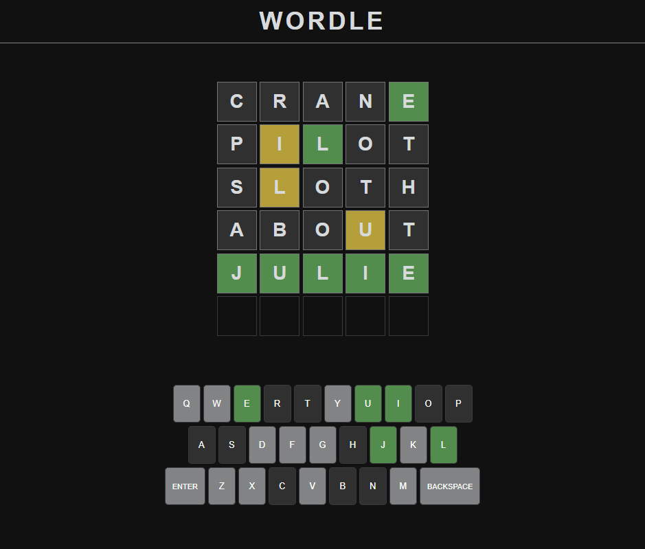

# Wordle Clone

A browser-based clone of the popular Wordle word game.

## Features

- Guess a five-letter word in six attempts.
- Colored feedback for each letter:
  - Green: correct letter and position
  - Yellow: correct letter, wrong position
  - Gray: letter not in the word
- Animated letter reveal and keyboard feedback.
- Only valid words are accepted.
- Responsive design for desktop and mobile.

## Getting Started

1. Clone or download this repository.
2. Open `index.html` in your browser.

## Project Structure

- [`index.html`](index.html): Main HTML file.
- [`index.css`](index.css): Styles for the game board and keyboard.
- [`index.js`](index.js): Game logic and UI interactions.
- [`words.js`](words.js): Word list for guesses and answers.

## Requirements

- Modern web browser (Chrome, Firefox, Edge, Safari) on desktop or mobile.

## Gameplay

## License

MIT
